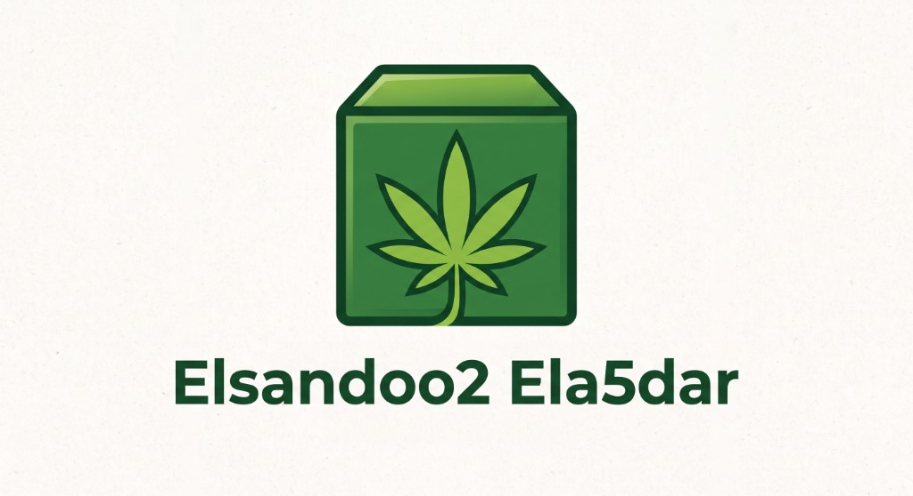

<div align="center">



# 📦 Elsandoo2 Ela5dar (الصندوق الأخضر)

### Automated AI Video & Custom Asset Slideshow Generator for Shorts, Reels & TikTok
**Developed & Customized by [Recode Developments](https://www.linkedin.com/in/osama-kamel-dev/) (Osama Kamel)**

[]()
[](https://www.python.org/)
[](LICENSE)
[](https://www.linkedin.com/in/osama-kamel-dev/)

<p align="center">
  <b>English</b> | <a href="#-باللغة-العربية">العربية</a>
</p>

</div>

---

## 🌟 Key Features

**Elsandoo2 Ela5dar** is an all-in-one AI video production suite designed for creators, marketers, and developers:

- 🛍️ **AI Product Link & Social Post Importer**:
  Paste any product link (Amazon, Noon, Shopify, AliExpress) or social post (TikTok, Instagram, Twitter/X). The system automatically scrapes product specs, downloads high-res images into your slideshow, and writes a customized marketing script tailored to your theme and dialect!
- 🖼️ **Custom Asset & Image Slideshow Uploader**:
  Upload your own photos (`.jpg`, `.png`, `.webp`, `.bmp`) or video clips (`.mp4`, `.mov`, `.webm`). The system automatically sequences your assets, calculates display duration, applies smooth transitions, and syncs perfectly with your voiceover narration and subtitles.
- 🤖 **AI Script & Keyword Generation**:
  Integrated with Ollama (100% offline & free), DeepSeek, OpenAI, Google Gemini, and Qwen to draft high-converting scripts in Arabic and English.
- 🎙️ **Natural Voice Synthesis (TTS)**:
  High-fidelity Microsoft Edge TTS voices (Arabic dialects, English, and more) with custom pitch, speed, and volume controls at zero cost.
- 📝 **Dynamic Animated Subtitles**:
  Automatically timed and styled captions (custom fonts, colors, stroke outlines, and background boxes).
- 🎬 **Stock Footage Integration**:
  Instantly search and pull HD stock footage from **Pexels** and **Pixabay**.
- 🎵 **Background Music Mixer**:
  Auto-ducking background audio that lowers music volume when the narrator speaks.

---

## 🚀 Quick Start (Zero-Setup 1-Click Installer)

**Elsandoo2 Ela5dar** includes an automated installer that runs on **any PC from scratch** (even if Python, FFmpeg, or C++ runtimes are not installed yet). It automatically checks, installs missing requirements, and keeps the repository updated from GitHub on every launch!

### Installation & Launch:
```bash
git clone https://github.com/osamakamel88/elSandoo2-ela5dar.git
cd elSandoo2-ela5dar
```
* **Step 1:** Double-click **`install.bat`**
  *(Automatically detects and installs Python 3.11, portable FFmpeg, Visual C++ Runtime, updates code from GitHub, and installs all dependencies)*.
* **Step 2:** Double-click **`run.bat`** to start the application at `http://localhost:8501`.

### Maintenance Tools:
* **`update.bat`**: Connects to GitHub, imports the latest version and updates any new dependencies.
* **`check_prerequisites.bat`**: Diagnostic dashboard to view the status of all prerequisites and auto-repair if needed.

---

## 🖼️ How to Use Custom Asset Slideshows

1. Open the Web UI (`http://localhost:8501`).
2. In **Video Settings** -> **Video Source**, choose **`Upload Custom Assets (Images & Videos)`**.
3. Upload your images or video clips.
4. Choose **Sequential** (plays in the order uploaded) or **Random**.
5. Enter your script (or let AI generate it) and click **Generate Video**!

---

## 🌐 باللغة العربية

**الصندوق الأخضر (Elsandoo2 Ela5dar)** هو نظام ذكي متكامل لتوليد مقاطع الفيديو القصيرة تلقائياً لمنصات تيك توك، ريلز، ويوتيوب شورتس:

* 🛍️ **استيراد المنتجات والمنشورات بالذكاء الاصطناعي (Product & Post Importer)**:
  إمكانية لصق رابط أي منتج (أمازون، نون، شوبيفاي، تيك توك، إلخ) ليقوم النظام تلقائياً بسحب تفاصيل المنتج ومواصفاته، وتحميل الصور الأصلية بجودة عالية، وتوليد سكريبت تسويقي مخصص وفقاً للثيم واللهجة المطلوبة.
* 🖼️ **ميزة رفع الصور والفيديوهات الخاصة (Slideshow Generator)**:
  إمكانية رفع صورك وفيديوهاتك الخاصة، ليقوم النظام تلقائياً بتوزيع مدة عرض كل صورة بدقة حسب طول التعليق الصوتي وإضافة انتقالات سينمائية وترجمة احترافية متزامنة.
* 🤖 **توليد السكريبتات الذكية**:
  دعم توليد نصوص الفيديوهات عبر نماذج الذكاء الاصطناعي المختلفة وميزة العمل دون اتصال بالإنترنت عبر Ollama.
* 🎙️ **تعليق صوتي طبيعي مجاني**:
  أصوات عربية طبيعية (لهجات سعودية، مصرية، إماراتية، إلخ) دون الحاجة لاشتراكات مدفوعة.
* 📝 **ترجمة تلقائية متحركة**:
  توليد النصوص والترجمة المتزامنة على الشاشة بألوان وخطوط مخصصة وجذابة.

---

## 👨‍💻 Developed by Recode Developments

Customized with ❤️ by **Osama Kamel** at **Recode Developments**.

🔗 LinkedIn: [https://www.linkedin.com/in/osama-kamel-dev/](https://www.linkedin.com/in/osama-kamel-dev/)
